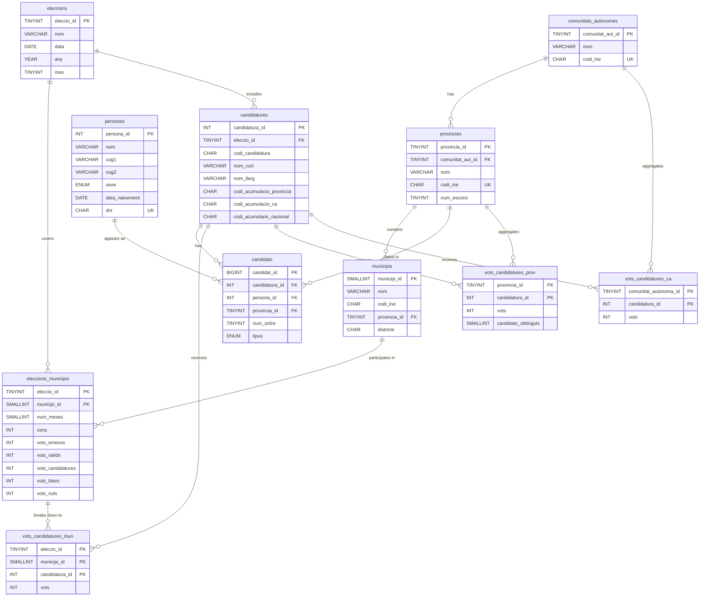

The database models Spanish general election data across three geographic levels and two electoral entity types. All 11 tables in the `mydb` MySQL database fall into one of three categories: geographic reference data, electoral entities, or vote aggregation.

<Note>
  All geographic codes follow the INE (Instituto Nacional de Estadística) coding standard. The `codi_ine` column on each geographic table stores the official INE identifier.
</Note>

## Geographic hierarchy

Spain's administrative structure forms a strict hierarchy. Every municipality belongs to a province, and every province belongs to an autonomous community. This hierarchy is enforced through foreign key constraints in the schema.

```text
Spain
└── Comunitat Autònoma  (comunitats_autonomes)
    └── Província       (provincies)
        └── Municipi    (municipis)
```

Each province stores a `num_escons` value — the number of seats in Congress it is allocated under the D'Hondt electoral method. This is the key figure used to convert vote counts into seat assignments.

## Entity-relationship diagram



## Vote aggregation tables

Vote data is stored at three levels of geographic granularity. Each level is a separate table rather than a view, because the raw INE import files supply pre-aggregated totals at each level independently.

| Table | Granularity | Extra data |
|---|---|---|
| `vots_candidatures_mun` | Election + municipality + party | Votes only |
| `vots_candidatures_prov` | Province + party | Votes + seats won (`candidats_obtinguts`) |
| `vots_candidatures_ca` | Autonomous community + party | Votes only |

<Tip>
  To compute the national vote share for a party, sum `vots` across all rows for that `candidatura_id` in `vots_candidatures_prov` (or `vots_candidatures_ca`). Do not use `vots_candidatures_mun` for national totals — some municipalities may have incomplete data.
</Tip>

Seat assignments (`candidats_obtinguts`) are only available at the province level. This reflects how the D'Hondt method is applied: seats are distributed per province, not per municipality or autonomous community.

## All tables at a glance

| Table | Category | Description |
|---|---|---|
| `comunitats_autonomes` | Geographic | Spain's 17 autonomous communities with INE codes |
| `provincies` | Geographic | 52 provinces, each with an INE code and seat allocation |
| `municipis` | Geographic | All municipalities, each linked to a province and district |
| `eleccions` | Electoral | Election events with date and auto-derived year and month |
| `eleccions_municipis` | Electoral | Per-municipality vote summary: census, turnout, blank, null |
| `persones` | Electoral | Personal data for every candidate (name, DOB, gender, DNI) |
| `candidatures` | Electoral | Political parties and electoral coalitions per election |
| `candidats` | Electoral | Candidate placement on a party list in a province |
| `vots_candidatures_mun` | Vote tracking | Votes received by each party in each municipality |
| `vots_candidatures_prov` | Vote tracking | Votes and seats won by each party in each province |
| `vots_candidatures_ca` | Vote tracking | Votes received by each party in each autonomous community |

## Tables by category

<CardGroup cols={3}>
  <Card title="Geographic tables" icon="map" href="/data-model/schema#geographic-tables">
    `comunitats_autonomes`, `provincies`, and `municipis` form the administrative hierarchy. All codes follow the INE standard.
  </Card>
  <Card title="Electoral tables" icon="users" href="/data-model/schema#electoral-tables">
    `eleccions`, `eleccions_municipis`, `persones`, `candidatures`, and `candidats` model the election events, parties, and candidates.
  </Card>
  <Card title="Vote tracking tables" icon="chart-bar" href="/data-model/schema#vote-tracking-tables">
    `vots_candidatures_mun`, `vots_candidatures_prov`, and `vots_candidatures_ca` store vote counts aggregated at each geographic level.
  </Card>
</CardGroup>

For the full column-level reference — types, constraints, indexes, and foreign keys — see the [schema reference](/data-model/schema).
